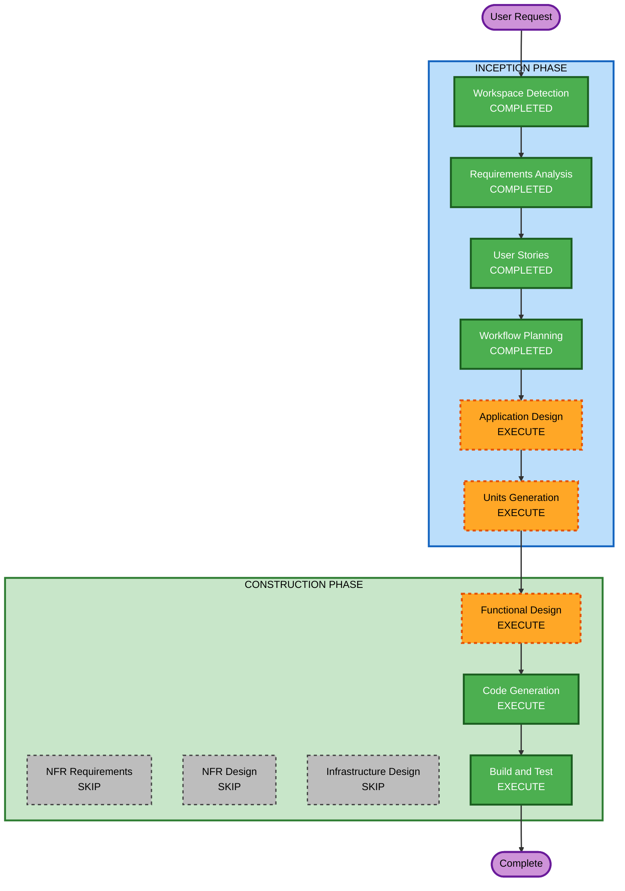

# Execution Plan

## Detailed Analysis Summary

### Change Impact Assessment
- **User-facing changes**: Yes - 고객 주문 UI + 관리자 대시보드 UI 신규 구축
- **Structural changes**: Yes - 전체 시스템 아키텍처 신규 설계 (React SPA + Node.js API + SQLite)
- **Data model changes**: Yes - 매장, 테이블, 메뉴, 카테고리, 주문, 세션 등 전체 데이터 모델 신규
- **API changes**: Yes - REST API + SSE 엔드포인트 전체 신규
- **NFR impact**: Yes - 실시간 통신(SSE), JWT 인증, bcrypt, 다국어(i18n)

### Risk Assessment
- **Risk Level**: Medium (신규 프로젝트이므로 기존 시스템 영향 없음, 다만 복잡도 높음)
- **Rollback Complexity**: Easy (Greenfield, 로컬 환경)
- **Testing Complexity**: Moderate (SSE 실시간 통신, 세션 관리, 다국어 테스트 필요)

---

## Workflow Visualization



### Text Alternative
```
INCEPTION PHASE:
  Workspace Detection    [COMPLETED]
  Requirements Analysis  [COMPLETED]
  User Stories           [COMPLETED]
  Workflow Planning      [COMPLETED]
  Application Design     [EXECUTE]
  Units Generation       [EXECUTE]

CONSTRUCTION PHASE (per-unit):
  Functional Design      [EXECUTE]
  NFR Requirements       [SKIP]
  NFR Design             [SKIP]
  Infrastructure Design  [SKIP]
  Code Generation        [EXECUTE]
  Build and Test         [EXECUTE]
```

---

## Phases to Execute

### INCEPTION PHASE
- [x] Workspace Detection (COMPLETED)
- [x] Requirements Analysis (COMPLETED)
- [x] User Stories (COMPLETED)
- [x] Workflow Planning (COMPLETED)
- [ ] Application Design - EXECUTE
  - **Rationale**: 신규 프로젝트로 컴포넌트 구조, 서비스 레이어, 데이터 모델 설계 필요. 고객 UI, 관리자 UI, API 서버, DB 간 관계 정의 필요.
- [ ] Units Generation - EXECUTE
  - **Rationale**: 프론트엔드(고객/관리자)와 백엔드가 독립적으로 개발 가능한 단위로 분해 필요. 복잡한 시스템이므로 구조화된 작업 단위 분해가 효율적.

### CONSTRUCTION PHASE (per-unit)
- [ ] Functional Design - EXECUTE
  - **Rationale**: 각 Unit별 데이터 모델, API 엔드포인트, 비즈니스 로직 상세 설계 필요. 주문 라이프사이클, 세션 관리 등 복잡한 비즈니스 규칙 존재.
- [ ] NFR Requirements - SKIP
  - **Rationale**: 기술 스택이 이미 결정됨 (React, Node.js, SQLite). NFR은 요구사항에서 충분히 정의됨 (SSE, JWT, bcrypt, i18n). 별도 NFR 분석 단계 불필요.
- [ ] NFR Design - SKIP
  - **Rationale**: NFR Requirements를 스킵하므로 NFR Design도 스킵. NFR 패턴은 Functional Design과 Code Generation에서 직접 반영.
- [ ] Infrastructure Design - SKIP
  - **Rationale**: 로컬 개발 환경 MVP. 클라우드 인프라 매핑 불필요. 배포는 로컬 실행으로 충분.
- [ ] Code Generation - EXECUTE (ALWAYS)
  - **Rationale**: 실제 코드 구현 필수.
- [ ] Build and Test - EXECUTE (ALWAYS)
  - **Rationale**: 빌드 및 테스트 지침 생성 필수.

---

## Success Criteria
- **Primary Goal**: 고객이 테이블에서 메뉴를 조회하고 주문할 수 있는 MVP 테이블오더 시스템
- **Key Deliverables**: React SPA (고객/관리자), Node.js API 서버, SQLite DB, SSE 실시간 통신
- **Quality Gates**: 모든 User Story의 Acceptance Criteria 충족, 실시간 주문 2초 이내 표시
